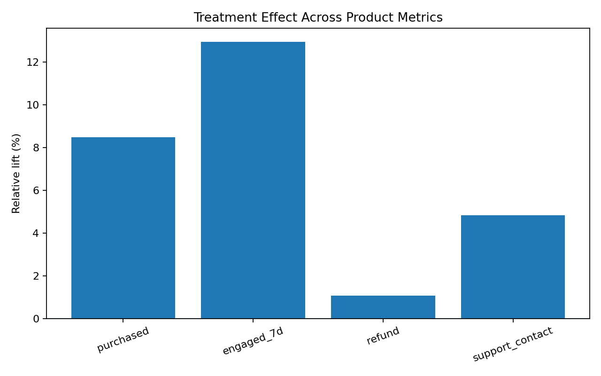

# Product Experimentation: Should We Launch a New Rewards Feature?

An end-to-end A/B testing project evaluating the causal impact of a new rewards feature on user engagement, conversion, revenue, and retention-related outcomes.

The project demonstrates how a product data scientist can move from randomized experiment design to statistical inference and a clear **ship / no-ship recommendation**.

---

## Business Problem

A consumer marketplace is considering launching a new rewards feature designed to increase purchasing activity and user engagement.

The product team wants to know:

> Does the rewards feature causally improve customer behavior enough to justify launching it broadly?

A simple comparison of users who interact with rewards versus those who do not would be vulnerable to selection bias. Instead, users are randomly assigned to treatment and control groups.

The experiment evaluates whether the feature improves the primary business outcome while ensuring that important customer-experience guardrails do not deteriorate.

---

## Experiment Design

The synthetic experiment contains **30,000 users** randomly assigned to:

- **Control:** existing product experience
- **Treatment:** product experience with the new rewards feature

Random assignment allows differences in outcomes to be interpreted causally.

### Primary Metric

**Purchase Conversion Rate**

The primary question is whether the rewards feature increases the probability that a user makes a purchase.

### Secondary Metrics

- Orders per user
- Revenue per user
- 7-day engagement

These metrics help determine whether the feature affects not only conversion but also the intensity and economic value of user activity.

### Guardrail Metrics

- Refund rate
- Support-contact rate

These guardrails help detect whether increased purchasing activity comes at the cost of worse customer experience.

---

## Experiment Validity

Before estimating treatment effects, I tested for **Sample Ratio Mismatch (SRM)**.

**SRM p-value: 0.652**

There is no evidence of a meaningful imbalance between treatment and control assignment.

This supports the integrity of the randomization process and allows us to proceed with causal interpretation of the experiment.

---

## Results

### Primary Outcome: Purchase Conversion

| Group | Conversion Rate |
|---|---:|
| Control | 36.49% |
| Treatment | 39.58% |

The rewards feature increased purchase conversion by approximately:

**+3.10 percentage points**

or approximately:

**+8.48% relative lift**

This represents a meaningful improvement in the experiment's primary product metric.

---

## Secondary Outcomes

The treatment also produced positive effects on broader user activity:

| Metric | Estimated Relative Lift |
|---|---:|
| Purchase Conversion | +8.48% |
| Orders per User | +15.70% |
| Revenue per User | +15.75% |
| 7-Day Engagement | +12.95% |

The consistency across these outcomes strengthens the evidence that the rewards feature changes economically meaningful user behavior rather than merely shifting a single metric.

---

## Covariate-Adjusted Estimate

To improve precision, I also estimated a regression-adjusted treatment effect using pre-treatment user characteristics including prior purchasing behavior and user attributes.

The adjusted treatment effect on conversion is approximately:

**+3.22 percentage points**

with strong statistical significance.

The similarity between the raw randomized estimate and the covariate-adjusted estimate provides an additional robustness check.

---

## Guardrail Analysis

A successful product experiment should not optimize conversion while creating negative downstream effects.

I therefore evaluated:

- Refund rate
- Support-contact rate

Neither guardrail showed evidence of a statistically meaningful deterioration.

This suggests that the increase in purchasing activity was not accompanied by a detectable increase in refunds or customer-support burden.

---

## Visualization



The figure summarizes estimated treatment lifts across the experiment's primary, secondary, and guardrail metrics.

---

## Product Recommendation

### SHIP

Based on the experimental evidence, I would recommend launching the rewards feature.

The treatment:

- increases purchase conversion by approximately **3.1 percentage points**
- increases orders per user by approximately **15.7%**
- increases revenue per user by approximately **15.8%**
- increases 7-day engagement by approximately **13.0%**
- does not produce detectable deterioration in key guardrail metrics

The evidence therefore suggests that the feature generates meaningful incremental business value without an obvious customer-experience tradeoff.

For a full production rollout, I would continue monitoring refund rates, support contacts, retention, and treatment-effect persistence after launch.

---

## Statistical Methods

This project demonstrates:

- Randomized controlled experimentation
- A/B testing
- Sample Ratio Mismatch (SRM) testing
- Difference-in-means estimation
- Confidence intervals
- Hypothesis testing
- Regression adjustment
- Covariate-based variance reduction
- Primary / secondary / guardrail metric design
- Product decision-making under uncertainty

---

## Tech Stack

**Python**

- pandas
- NumPy
- statsmodels
- SciPy
- matplotlib
- scikit-learn

**SQL**

Used to construct experiment scorecards and aggregate product metrics by treatment assignment.

---

## Repository Structure

```text
product-experimentation-ab-testing/
│
├── notebooks/
│   └── rewards_experiment.ipynb
│
├── results/
│   ├── experiment_results.csv
│   ├── experiment_summary.csv
│   └── metric_lifts.png
│
├── sql/
│   └── experiment_metrics.sql
│
├── src/
│   ├── __init__.py
│   ├── experiment_analysis.py
│   ├── generate_experiment.py
│   └── plotting.py
│
├── tests/
│   └── test_experiment.py
│
├── .gitignore
├── README.md
├── RESUME_BULLET.txt
└── requirements.txt
```

---

## Reproducing the Analysis

Install the required packages:

```bash
pip install -r requirements.txt
```

Generate the synthetic experiment data:

```bash
python src/generate_experiment.py
```

Run the experiment analysis:

```bash
python src/experiment_analysis.py
```

Generate the visualization:

```bash
python src/plotting.py
```

---

## Why This Project Matters

A statistically significant experiment is not automatically a successful product decision.

The goal of experimentation is to connect causal evidence to a real business decision.

This project therefore combines:

**experiment design → causal estimation → robustness checks → business metrics → guardrails → product recommendation**

rather than treating A/B testing as only a hypothesis-testing exercise.

---

## Data

All data used in this repository are **fully synthetic** and were generated specifically for this portfolio project. No proprietary or confidential company data are used.
